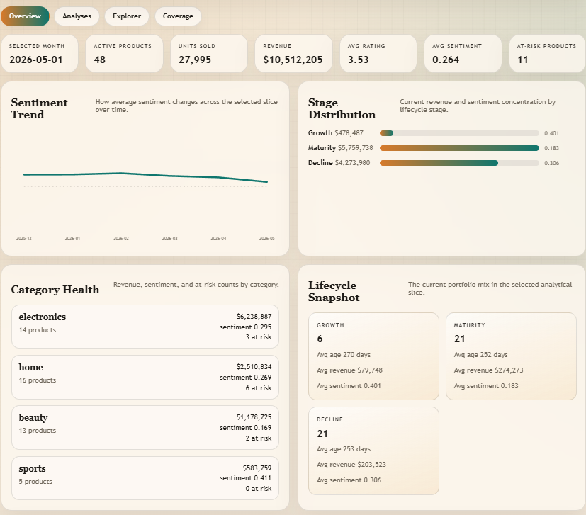
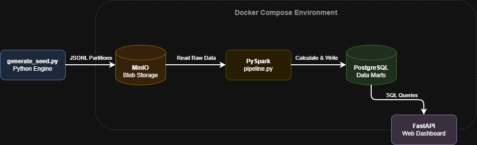

# E-Commerce Sentiment & Product Life Cycles




> A highly scalable, local-first Big Data pipeline that automatically classifies product lifecycles, tracks sentiment shifts, and flags at-risk inventory across an e-commerce portfolio.

## 🏗 Architecture & Tech Stack

This project was built to process large-scale datasets (1.5 GB+) locally and reliably. 



* **Data Generation:** Custom Python engine generating synthetic Hive-partitioned JSONL data.
* **Blob Storage:** MinIO (S3-compatible) for raw data staging.
* **Processing Engine:** PySpark for heavy-duty metric aggregation and scoring.
* **Data Marts:** PostgreSQL for optimized downstream dashboard querying.
* **API & Frontend:** FastAPI serving a responsive, custom-styled HTML/CSS dashboard.
* **Orchestration:** Docker Compose and automated Bash scripts.

## 📊 Core Analyses

The Spark pipeline produces three non-arbitrary business analyses:
1. **Sentiment Trends:** Tracks customer sentiment over time and maps it against current lifecycle stages.
2. **Lifecycle Classification:** Automatically assigns "Introduction," "Growth," "Maturity," or "Decline" stages based on sell-through velocity and age ratios.
3. **Risk & Opportunity Scoring:** Calculates actionable scores (0-100) based on return rates, stockouts, sentiment deltas, and revenue shifts.

---

## 🚀 Quick Start (Demo Mode)

To run a fast, 50MB demo version of the pipeline to see the dashboard in action:

**1. Set up the environment** *(Optional: create `.env` from `.env.example` if you want to override default ports/passwords).*

**2. Start the database and web server**
```bash
./scripts/start_stack.sh